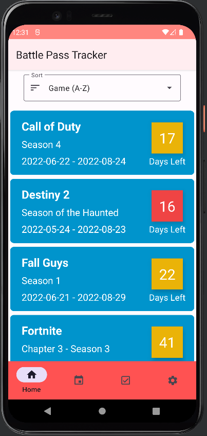
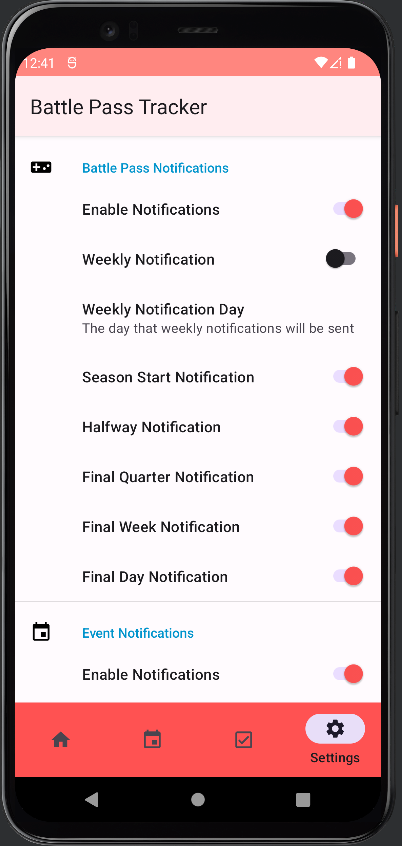

  
  <h1 align="center">Battle Pass Tracker</h1>
  <a href="https://play.google.com/store/apps/details?id=com.jdu.battlepasstracker&pcampaignid=pcampaignidMKT-Other-global-all-co-prtnr-py-PartBadge-Mar2515-1">Google Play Store</a>
  ·
  <a href="https://github.com/Jimmy-Du/battle-pass-tracker-android/issues">Report Bug</a>
  ·
  <a href="https://github.com/Jimmy-Du/battle-pass-tracker-android/issues">Request Feature</a>

## About The Project:

  
  
  

With more and more games adding battle passes and limited time in game events, it can be overwhelming to keep up with all of them. Battle Pass Tracker is an Android, web, and Windows application that displays the dates of battle passes and in game events of various video games. The goal of this project is to allow users to have a central hub where they can view the dates of the battle passes and in game events, of the games that they play, so that they can prioritize the battle passes and events that are the closest to expiring in order to obtain all rewards given out by the video games. This version is for Android that features notifications pushed to your Android device for specific time intervals of the battle passes and events.

## Built With:
<ul>
  <li>
    
  </li>
  <li>
    
  </li>
  <li>Retrofit</li>
</ul>

## Other Versions
This repo is for the Android version of Battle Pass Tracker. Click on the links below to visit the repositories of the Web, or Windows versions or to go to the Google Play Store to download it to your Android devices.
<ul>
  <li><a href='https://github.com/Jimmy-Du/battle-pass-tracker'>Web</a></li>
  <li><a href='https://github.com/Jimmy-Du/battle-pass-tracker-wpf'>Windows</a></li>
</ul>

Google Play and the Google Play logo are trademarks of Google LLC.