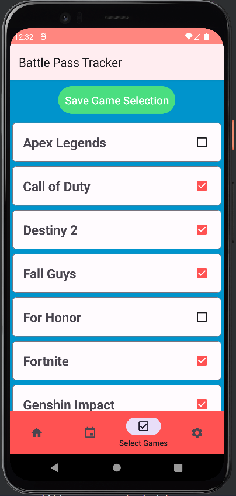

# Battle Pass Tracker for Android
This is the android version of the Battle Pass Tracker Web Application that can be found [here](https://github.com/Jimmy-Du/battle-pass-tracker).
The goal of this android application is to provide users a quick and easy way to view battle pass info 
for the games that they play. Users can also opt-in for notifications displayed directly on their phone
when certain periods of time has passed during the battle pass season to remind them of when the season 
is ending.

## Downloads
[Google Play](https://play.google.com/store/apps/details?id=com.jdu.battlepasstracker)

## Screenshots

  
  
  
  

## Built With
- Material 3
- Kotlin
- Retrofit

## Web Version
For the web application version/repository click [here.](https://github.com/Jimmy-Du/battle-pass-tracker)